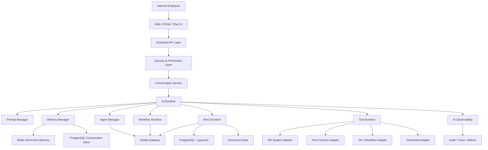

# 01 - 企业级银行 AI Assistant 整体系统架构设计

## 1. 本阶段目标

本阶段不写代码。

我们先建立一个企业级 AI Assistant 的系统蓝图，明确后续每一阶段要落地的工程边界、Runtime 边界和演进路线。

这个项目的核心不是“调一次大模型 API”，而是构建一个可扩展、可治理、可观测、可审计的企业 AI 应用系统。

对于传统 Java 后端工程师来说，最大的思维转换是：

| 传统后端系统 | AI 应用系统 |
| --- | --- |
| 请求进来，确定性业务逻辑处理，返回结果 | 请求进来，模型参与推理，可能调用工具、检索知识、执行流程，再返回结果 |
| Controller -> Service -> Repository | User Message -> AI Runtime -> Agent/Workflow -> Tool/RAG/Memory -> Model -> Streaming Response |
| 主要关注接口、事务、数据一致性 | 额外关注 Prompt、Context、Token、State、Tool 调度、安全边界 |
| 逻辑主要写在代码里 | 一部分逻辑在代码里，一部分行为由 Prompt、模型能力和 Runtime 编排共同决定 |
| 可预测性较强 | 需要治理不确定性、幻觉、越权调用、上下文污染 |

所以，本项目的核心架构目标是：

1. 把 AI 能力纳入企业工程体系，而不是散落在 Controller 里。
2. 把模型调用、工具调用、RAG、Memory、Workflow、安全控制设计成可治理的 Runtime。
3. 让 AI Assistant 可以从简单 Tool Calling 平滑演进到 ReAct Agent、Workflow Agent、Multi-Agent。

## 2. 业务场景边界

银行内部员工 AI Assistant 的初始能力包括：

- 查询积分余额
- 查询积分历史
- 提交假期申请
- 提交 OT 申请
- 填写工时
- 查询公司制度
- 企业知识问答
- 工作流审批辅助

这些能力可以分为三类：

| 能力类型 | 示例 | AI 系统关注点 |
| --- | --- | --- |
| 业务查询型 Tool | 查询积分余额、查询积分历史 | 权限校验、参数抽取、工具调用、结构化返回 |
| 业务提交型 Tool/Workflow | 假期申请、OT 申请、填写工时 | 表单补全、确认机制、审批流、审计 |
| 知识问答型 RAG | 公司制度、HR 政策、流程说明 | 文档检索、引用来源、上下文压缩、幻觉控制 |
| 审批辅助型 Workflow | 审批摘要、风险提示、下一步建议 | 状态流转、规则引擎、人工确认、可追溯 |

这意味着我们不能只做一个简单 Chat API。

我们需要的是：

```text
AI Assistant = Conversation Runtime + Agent Runtime + Tool Runtime + RAG Runtime + Workflow Runtime + Governance
```

## 3. 总体架构

推荐的企业级分层如下：



核心原则：

1. Controller 不直接调用大模型。
2. 业务 Service 不直接拼 Prompt。
3. Tool 不直接信任模型参数。
4. RAG 不直接把检索结果无脑塞进 Prompt。
5. Workflow 不交给模型自由发挥，关键状态必须由 Runtime 管理。
6. 所有模型输入输出、工具调用、检索结果、审批动作都要可观测、可审计。

## 4. 系统模块划分

### 4.1 API 接入层

职责：

- 提供 REST API 和 SSE Streaming API
- 接收用户消息
- 传递用户身份、组织、角色、权限上下文
- 管理请求级 traceId / conversationId / messageId
- 把流式响应推送给前端

为什么这样设计：

AI Assistant 的前端响应通常不是一次性返回，而是流式返回。尤其当模型需要推理、检索、调用工具时，用户需要看到阶段性输出，例如“正在查询积分余额”“需要你确认假期申请”。

行业常见方案：

- REST API：用于普通配置、历史记录、会话管理
- SSE：用于文本生成流
- WebSocket：用于更复杂的双向协作
- gRPC Streaming：多用于内部高性能服务间通信

当前阶段选择：

我们优先使用 SSE Streaming。

原因：

- Spring Boot 支持成熟
- 浏览器接入简单
- 适合 Chat Completion 的单向流
- 后续可演进到 WebSocket

权衡：

| 方案 | 优点 | 缺点 |
| --- | --- | --- |
| REST | 简单稳定 | 不适合流式体验 |
| SSE | 实现简单、适合模型输出 | 主要是服务端到客户端单向 |
| WebSocket | 双向实时能力强 | 状态管理更复杂 |

### 4.2 Conversation Service

职责：

- 管理会话
- 保存用户消息和助手消息
- 维护 conversationId、messageId、turnId
- 调用 AI Runtime
- 负责把 Runtime 事件转换为前端可消费的 SSE 事件

为什么需要单独的 Conversation Service：

传统后端系统里，Controller 常常直接调用业务 Service。但 AI 应用里，一次用户请求可能产生多个内部事件：

```text
User Message
 -> Prompt Build
 -> Model Thinking
 -> Tool Call Request
 -> Tool Result
 -> Model Final Answer
 -> Memory Update
 -> Audit Log
```

如果这些逻辑堆在 Controller 中，系统会很快变成不可维护的“AI 大杂烩”。

当前阶段选择：

先实现基础 Conversation Service，负责：

- 接收用户消息
- 创建上下文
- 调用 Agent
- 返回流式事件
- 保存基础消息记录

后续演进：

- 多轮上下文裁剪
- 会话摘要
- 用户偏好记忆
- 对话级权限上下文
- Conversation Replay

## 5. AI Runtime 架构

### 5.1 AI Runtime 的定位

AI Runtime 是整个项目的核心。

它不是某个框架类，也不是简单的 `ChatClient` 包装，而是 AI 应用运行时的统一编排层。

职责：

- 接收用户输入和业务上下文
- 构造 Prompt
- 管理短期上下文
- 决定走 Agent、Workflow 还是 RAG
- 调用模型
- 调度 Tool
- 管理 Structured Output
- 输出 Streaming Event
- 记录可观测数据
- 执行安全策略

可以把它理解为 AI 应用里的“应用服务器 + 调度器 + 策略引擎”。

### 5.2 Runtime 数据流

一次典型请求的数据流：

```text
1. 用户输入消息
2. API 层附加用户身份、租户、角色、权限、渠道信息
3. Conversation Service 创建 Turn Context
4. AI Runtime 加载会话历史和短期记忆
5. Intent/Router 判断任务类型
6. Prompt Manager 构造系统提示词、任务提示词、工具说明、上下文片段
7. Model Gateway 调用 LLM
8. 模型产生 Tool Call 或直接回答
9. Tool Runtime 校验工具权限和参数
10. Tool Adapter 调用真实业务系统
11. Tool Result 返回给模型
12. 模型生成最终答案
13. Memory Manager 保存必要上下文
14. Observability 记录 trace、token、latency、tool call、retrieval
15. SSE 返回前端
```

### 5.3 AI Runtime 内部模块

推荐拆分：

| 模块 | 职责 |
| --- | --- |
| Agent Runtime | 处理 Tool Calling、ReAct、Agent Loop |
| Workflow Runtime | 处理确定性流程、审批、表单补全、人工确认 |
| RAG Runtime | 处理知识检索、上下文注入、引用来源 |
| Prompt Manager | 管理 Prompt 模板、版本、变量渲染 |
| Memory Manager | 管理短期记忆、长期记忆、会话摘要 |
| Tool Runtime | 管理工具注册、权限、参数校验、执行 |
| Model Gateway | 多模型接入、fallback、retry、限流 |
| Safety Guard | 输入输出安全、越权检测、敏感信息控制 |
| Observability | trace、metrics、日志、审计、成本统计 |

### 5.4 为什么不让业务代码直接调用 LLM

Demo 级写法通常是：

```text
Controller -> ChatClient -> LLM
```

基础实现可能是：

```text
Controller -> AssistantService -> ChatClient -> LLM
```

企业级实现应该是：

```text
Controller
 -> Conversation Service
 -> AI Runtime
 -> Agent / Workflow / RAG
 -> Model Gateway
```

原因：

- 模型调用不是普通远程调用，它会消耗 token、产生不确定输出、触发工具调用。
- Prompt、Memory、Tool、RAG、安全策略都需要统一治理。
- 后续多模型切换、fallback、审计、成本控制不能散落在业务代码里。

## 6. Tool Runtime 架构

### 6.1 Tool 的企业级定义

Tool 不是简单的 Java 方法。

在企业 AI 系统中，Tool 是“模型可以请求调用，但必须由系统 Runtime 审核和执行的受控业务能力”。

一个企业级 Tool 至少包含：

- toolName
- description
- input schema
- output schema
- permission policy
- risk level
- idempotency policy
- audit policy
- timeout
- retry policy
- confirmation policy
- executor

### 6.2 Tool Runtime 数据流

```text
LLM 生成 Tool Call
 -> Tool Runtime 解析工具名和参数
 -> 检查工具是否存在
 -> 检查用户是否有权限
 -> 校验参数 schema
 -> 执行业务前置规则
 -> 必要时要求用户确认
 -> 调用 Tool Executor
 -> 记录审计日志
 -> 返回结构化 Tool Result
 -> 交还给 Agent Runtime
```

### 6.3 初始 Tool 划分

第一批 Tool 建议只做三个：

| Tool | 类型 | 风险等级 | 是否需要确认 |
| --- | --- | --- | --- |
| `point.balance.query` | 查询型 | 低 | 否 |
| `point.history.query` | 查询型 | 低 | 否 |
| `leave.application.submit` | 提交型 | 中 | 是 |

为什么先选这三个：

- 覆盖查询型和提交型两类核心模式
- 查询积分能验证 Tool Calling 的最小闭环
- 假期申请能引入结构化参数、缺槽追问、用户确认
- 复杂度可控，不会过早陷入全量业务系统集成

### 6.4 Tool Runtime 分层

推荐结构：

```text
Tool Registry
 -> Tool Definition
 -> Tool Policy
 -> Tool Parameter Validator
 -> Tool Executor
 -> Business Adapter
```

说明：

- Tool Registry：注册系统可用工具
- Tool Definition：给模型看的工具描述和参数 schema
- Tool Policy：给系统看的权限、风险、确认、审计规则
- Tool Validator：校验模型生成的参数是否合规
- Tool Executor：执行工具调用的应用层入口
- Business Adapter：对接真实业务系统，例如积分系统、HR 系统

### 6.5 Tool 设计中的关键原则

1. 模型只负责“提出调用意图”，不能直接执行业务动作。
2. 所有提交型工具必须有确认机制。
3. Tool 参数必须做 schema 校验和业务校验。
4. Tool 返回结果必须结构化，不能只返回一段自然语言。
5. Tool 调用必须记录审计日志。
6. Tool 权限必须基于用户身份，而不是基于模型判断。

### 6.6 Demo、基础、企业级差异

| 层级 | 特征 | 风险 |
| --- | --- | --- |
| Demo 级 | 用 `@Tool` 暴露一个方法 | 缺少权限、审计、确认、安全控制 |
| 基础实现 | 有工具注册和参数 DTO | 仍可能缺少策略治理 |
| 企业级实现 | Tool Definition + Policy + Runtime + Audit | 复杂度更高，但可治理 |

## 7. RAG 架构

### 7.1 RAG 的定位

RAG 用于回答企业制度、流程文档、知识库问题。

它不是“把文档丢给向量库”这么简单，而是一套知识运行时：

```text
Document Ingestion -> Chunking -> Embedding -> Indexing -> Retrieval -> Rerank -> Context Build -> Answer with Citation
```

### 7.2 RAG 数据流

```text
用户问题
 -> Query Rewrite
 -> 权限过滤
 -> 向量检索 pgvector
 -> 关键词/结构化检索
 -> Hybrid Merge
 -> Rerank
 -> Context Compression
 -> Prompt 注入
 -> 模型回答
 -> 引用来源返回
 -> 记录检索 trace
```

### 7.3 为什么银行内部知识问答必须做权限过滤

企业知识不是完全公开的。

不同员工能看的制度、流程、审批细则可能不同。例如：

- 普通员工只能看员工手册
- HR 可以看更详细的人事规则
- 管理者可以看审批政策
- 风控或审计岗位可以看特定合规文件

因此 RAG 不能只按相似度检索，还必须按权限检索。

推荐索引元数据：

| 字段 | 说明 |
| --- | --- |
| documentId | 文档 ID |
| chunkId | 切片 ID |
| title | 文档标题 |
| department | 所属部门 |
| visibility | 可见范围 |
| effectiveDate | 生效日期 |
| version | 文档版本 |
| tags | 标签 |
| sourceUri | 来源 |

### 7.4 RAG 技术选择

当前阶段推荐：

- PostgreSQL 保存文档元数据、文档版本、chunk 记录
- pgvector 保存 embedding
- Spring AI 或 LangChain4j 负责 embedding 调用和向量检索封装
- 后续引入 rerank 模型

为什么选择 PostgreSQL + pgvector：

- 和 Java 企业后端技术栈融合自然
- 部署成本低
- 事务、权限、元数据管理方便
- 适合项目早中期

权衡：

| 方案 | 优点 | 缺点 |
| --- | --- | --- |
| pgvector | 简洁、易部署、适合业务系统融合 | 超大规模检索能力不如专用向量数据库 |
| Milvus | 大规模向量检索能力强 | 运维复杂度更高 |
| Elasticsearch Hybrid | 关键词检索强 | 向量能力和成本要综合评估 |

### 7.5 RAG 的企业级要求

1. 回答必须尽量带引用来源。
2. 检索必须做权限过滤。
3. 文档版本必须可追溯。
4. Prompt 中注入的上下文必须控制 token。
5. 无命中时要明确说不知道，不能编造。
6. 需要记录每次回答用了哪些 chunk。

## 8. Memory 架构

### 8.1 Memory 的定位

Memory 不是简单把所有历史消息塞给模型。

Memory 是对话状态和用户上下文的分层管理。

推荐分为：

| Memory 类型 | 保存内容 | 存储 | 生命周期 |
| --- | --- | --- | --- |
| Turn Context | 当前轮输入、工具结果、临时状态 | 内存 | 单次请求 |
| Short-term Memory | 最近几轮对话 | Redis / PostgreSQL | 会话期间 |
| Conversation Summary | 会话摘要 | PostgreSQL | 长期 |
| User Profile Memory | 用户偏好、常用信息 | PostgreSQL | 长期，需授权 |
| Workflow State | 未完成表单、审批状态 | PostgreSQL | 流程完成前 |

### 8.2 为什么不能无脑保存和注入所有历史

原因：

- token 成本会迅速上升
- 无关上下文会干扰模型判断
- 历史中可能存在过期信息
- 可能把敏感信息带入不相关请求
- 多轮对话可能发生 prompt injection 污染

### 8.3 Memory 数据流

```text
用户发起新消息
 -> 加载最近 N 轮消息
 -> 加载会话摘要
 -> 加载当前未完成 Workflow State
 -> 根据当前任务选择相关 Memory
 -> 构造 Prompt Context
 -> 模型生成结果
 -> 提取需要保存的状态
 -> 更新 Memory / Summary / Workflow State
```

### 8.4 当前阶段选择

第二阶段最小闭环中，我们只做：

- 最近消息保存
- 当前请求上下文
- Tool 调用结果进入当前轮上下文

第三、第四阶段再引入：

- 会话摘要
- Workflow State
- 长期用户记忆

这样做是为了避免在 Agent 闭环还没稳定时过早引入复杂 Memory。

## 9. Workflow 架构

### 9.1 Workflow 的定位

Workflow 用来处理确定性较强、状态明确、风险较高的业务流程。

例如：

- 假期申请
- OT 申请
- 工时填写
- 审批辅助

这些场景不能完全交给 Agent 自由推理，因为它们涉及：

- 表单字段
- 业务规则
- 用户确认
- 审批流
- 审计
- 状态持久化

### 9.2 Agent 与 Workflow 的边界

| 能力 | Agent 适合 | Workflow 适合 |
| --- | --- | --- |
| 用户意图理解 | 是 | 否 |
| 参数抽取 | 是 | 部分 |
| 缺槽追问 | 是 | 是 |
| 状态流转 | 不适合作为唯一来源 | 是 |
| 审批提交 | 需要 Runtime 控制 | 是 |
| 审计 | 需要系统记录 | 是 |

推荐思路：

```text
Agent 理解用户想做什么
Workflow 管理接下来必须怎么做
Tool 执行最终业务动作
```

### 9.3 假期申请示例状态

```text
START
 -> COLLECT_LEAVE_TYPE
 -> COLLECT_DATE_RANGE
 -> COLLECT_REASON
 -> VALIDATE_POLICY
 -> USER_CONFIRM
 -> SUBMIT_APPLICATION
 -> COMPLETED
```

这个状态不能只存在 Prompt 里，必须由系统持久化。

否则用户刷新页面、模型重试、服务重启时，流程状态会丢失。

### 9.4 LangGraph4j 的使用阶段

第四阶段再引入 LangGraph4j。

原因：

- 第一阶段先完成架构认知
- 第二阶段先跑通最小 Agent + Tool
- 第三阶段接入 RAG
- 第四阶段再把状态机和 Agent Loop 显式图化

这符合企业落地节奏：先闭环，再治理，再图化和编排。

### 9.5 Workflow Runtime 企业级要求

1. 状态必须持久化。
2. 状态流转必须可审计。
3. 高风险动作必须用户确认。
4. 模型不能绕过状态机直接提交。
5. 失败后可重试、可恢复。
6. 后续支持人工介入。

## 10. Prompt 管理设计

### 10.1 Prompt 的定位

Prompt 是 AI 应用的“行为配置 + 运行指令 + 上下文组装协议”。

在企业系统里，Prompt 不能散落在 Java 字符串里。

它需要被版本化、测试、审计和灰度。

### 10.2 Prompt 分层

推荐分为：

| Prompt 层级 | 内容 |
| --- | --- |
| System Prompt | Assistant 身份、边界、安全要求 |
| Developer Prompt | 当前应用规则、输出格式、工具使用规则 |
| Task Prompt | 本轮任务说明 |
| Tool Prompt | 工具列表、参数说明、调用约束 |
| RAG Context | 检索到的知识片段 |
| Memory Context | 历史摘要、当前流程状态 |
| User Message | 用户原始输入 |

### 10.3 Prompt 构造顺序

```text
System Instruction
 -> Security Policy
 -> Role / Permission Context
 -> Task Instruction
 -> Tool Definitions
 -> Memory Context
 -> RAG Context
 -> User Message
```

### 10.4 Prompt 管理方式

当前阶段：

- 使用文件或数据库保存 Prompt 模板
- 使用版本号管理
- 在代码中通过 Prompt Manager 加载和渲染

后续阶段：

- Prompt Registry
- Prompt Versioning
- Prompt A/B Testing
- Prompt Evaluation
- Prompt Change Audit

### 10.5 Prompt 的企业级风险

| 风险 | 示例 | 控制方式 |
| --- | --- | --- |
| Prompt 漂移 | 修改提示词导致 Tool 调用异常 | 版本管理、回归测试 |
| Prompt Injection | 文档中诱导模型忽略系统规则 | RAG 内容隔离、安全指令 |
| Token 膨胀 | 注入过多历史和文档 | Context 选择、摘要、压缩 |
| 输出不稳定 | 格式不符合后端解析 | Structured Output、schema 校验 |

## 11. 权限与安全设计

### 11.1 安全边界

银行内部 AI Assistant 至少需要以下安全边界：

| 安全层 | 说明 |
| --- | --- |
| 用户认证 | 确认用户身份 |
| 权限授权 | 控制能使用哪些 Tool、查看哪些知识 |
| 数据脱敏 | 防止敏感信息泄露 |
| Tool 安全 | 防止越权业务操作 |
| RAG 安全 | 防止检索未授权文档 |
| Prompt Injection 防护 | 防止用户或文档劫持模型行为 |
| 输出安全 | 防止输出敏感、违规或误导内容 |
| 审计日志 | 记录关键输入、输出、工具调用和审批动作 |

### 11.2 权限上下文

每次请求进入 AI Runtime 时，必须携带权限上下文：

```text
UserContext {
  userId
  employeeNo
  department
  roles
  permissions
  dataScopes
  locale
  tenantId
}
```

模型可以看到其中一部分低敏信息，例如角色、部门、可用能力。

但真正的权限判断必须由系统代码执行，不能交给模型。

### 11.3 Tool 权限控制

例如查询积分余额：

```text
用户问：“帮我查一下我的积分余额”
 -> 模型请求调用 point.balance.query
 -> Tool Runtime 检查用户是否有 point:balance:read 权限
 -> Tool Executor 强制使用当前登录用户 employeeNo
 -> 不允许模型传入任意 employeeNo 查询他人积分
```

这点非常关键。

企业级 Tool 不能完全信任模型生成的参数，尤其不能允许模型决定数据范围。

### 11.4 RAG 权限控制

RAG 检索时必须基于 `UserContext.dataScopes` 过滤。

错误做法：

```text
先全库向量检索，再把最相似内容给模型
```

正确做法：

```text
先结合权限范围过滤候选文档，再做向量检索和 rerank
```

或者至少在检索 SQL 中同时包含向量相似度和权限条件。

### 11.5 审计设计

需要审计的事件：

- 用户消息
- 模型响应
- Prompt 版本
- 模型名称
- token 消耗
- Tool Call 请求
- Tool 参数
- Tool 执行结果
- RAG 命中的 chunk
- 用户确认动作
- Workflow 状态流转
- 安全拦截事件

审计日志不是普通 debug log。

它要支持：

- 问题追溯
- 合规检查
- 成本分析
- 质量评估
- 安全事件调查

## 12. Model Gateway 设计

虽然第一阶段不直接实现，但架构上要预留。

Model Gateway 职责：

- 屏蔽不同模型供应商差异
- 统一 chat、embedding、rerank 调用接口
- 支持模型路由
- 支持 fallback
- 支持 retry
- 支持限流
- 记录 token 和 latency

当前阶段可以先简单封装 Spring AI / LangChain4j 调用。

后续演进为：

```text
ModelGateway
 -> ChatModelClient
 -> EmbeddingModelClient
 -> RerankModelClient
 -> ModelRouter
 -> FallbackPolicy
 -> CostTracker
```

## 13. AI Observability 设计

### 13.1 为什么 AI 需要单独的可观测性

传统服务关注：

- QPS
- latency
- error rate
- DB 慢查询
- JVM 指标

AI 应用还要关注：

- Prompt 版本
- 输入 token
- 输出 token
- 总成本
- 模型延迟
- Tool 调用次数
- Tool 失败率
- RAG 命中率
- RAG 引用质量
- Agent loop 次数
- 用户确认率
- 安全拦截率

### 13.2 Trace 结构

推荐一次请求形成完整 trace：

```text
ConversationTrace
 -> TurnTrace
    -> PromptBuildTrace
    -> ModelCallTrace
    -> ToolCallTrace
    -> RetrievalTrace
    -> WorkflowTrace
    -> SafetyTrace
    -> StreamingTrace
```

这样当用户说“AI 答错了”时，我们能回答：

- 当时用户问了什么
- 系统构造了什么 Prompt
- 用了哪个模型
- 检索到了哪些文档
- 调用了哪些 Tool
- Tool 返回了什么
- 模型最终为什么这样回答

## 14. 推荐工程模块

后续 Spring Boot 工程可以按如下模块演进：

```text
bank-ai-assistant
  assistant-api              # REST/SSE API
  assistant-application      # Conversation、用例编排
  assistant-ai-runtime       # Agent、Prompt、Memory、Model Gateway
  assistant-tool-runtime     # Tool 注册、策略、执行
  assistant-rag              # 文档、Embedding、Retriever
  assistant-workflow         # Workflow、状态机、LangGraph4j
  assistant-security         # 权限、安全、脱敏
  assistant-observability    # Trace、Audit、Metrics
  assistant-domain           # 业务领域模型
  assistant-infrastructure   # DB、Redis、外部系统适配
```

如果初期不想过度拆 Maven Module，也可以先在单体 Spring Boot 中按 package 分层：

```text
com.bank.assistant
  api
  application
  airuntime
  toolruntime
  rag
  workflow
  security
  observability
  domain
  infrastructure
```

当前阶段建议：

先使用单体工程 + 清晰 package 分层。

原因：

- 学习和迭代成本低
- 方便快速跑通 AI 闭环
- 仍然保留未来拆模块边界

等到 Tool、RAG、Workflow 稳定后，再考虑 Maven 多模块。

## 15. 当前阶段架构取舍

### 15.1 我们现在不做什么

第一阶段不做：

- 完整多 Agent
- 完整 LangGraph4j 状态图
- 复杂 RAG rerank
- 全量权限系统
- 复杂 Prompt 平台
- 完整模型网关
- 企业级监控大盘

原因：

企业级架构不是第一天就把所有组件堆起来。

真正合理的路线是：

```text
先设计边界
 -> 跑通最小闭环
 -> 找到真实复杂点
 -> 再把 Runtime 能力逐步抽象出来
```

### 15.2 我们现在必须坚持什么

即使第一版很小，也必须坚持：

- Controller 不直接调模型
- Tool 调用必须经过 Runtime
- Tool 参数必须校验
- 提交型 Tool 必须确认
- Prompt 必须集中管理
- 会话和工具调用必须可追踪
- 权限判断不能交给模型
- RAG 必须预留文档权限和引用来源

这些是企业级 AI 应用的底线。

## 16. 后续阶段落地路线

### 第二阶段：最小 AI Agent 闭环

目标：

```text
用户 -> Agent -> Tool -> 结构化结果 -> Streaming 返回
```

优先实现：

1. 查询积分余额
2. 查询积分历史
3. 假期申请

关键能力：

- Tool Calling
- Prompt Manager
- Structured Output
- SSE Streaming
- 基础 Context 管理
- Tool 审计日志

### 第三阶段：RAG 能力

目标：

```text
企业文档 -> 切片 -> Embedding -> pgvector -> Retriever -> Prompt 注入 -> 带引用回答
```

关键能力：

- 文档导入
- Chunking
- Embedding
- Vector Search
- Retriever
- Rerank 预留
- 引用来源
- 权限过滤

### 第四阶段：AI Runtime 升级

目标：

使用 LangGraph4j 显式管理 Agent/Workflow 状态。

关键能力：

- StateGraph
- Conditional Edge
- Checkpoint
- Workflow Runtime
- Agent 状态管理
- 可恢复流程

### 第五阶段：企业级增强

目标：

把系统从“能用”提升到“可治理、可运维、可合规”。

关键能力：

- Token 优化
- Prompt Versioning
- AI Observability
- Model Fallback
- Retry
- 权限控制
- 审计日志
- AI 安全控制

### 第六阶段：Multi-Agent

目标：

引入专业 Agent 协作。

候选 Agent：

- Planner Agent
- HR Agent
- Knowledge Agent
- Workflow Agent
- Tool Router

注意：

Multi-Agent 不是越早越好。

如果没有稳定的 Tool Runtime、Memory、Workflow、Observability，多 Agent 只会放大复杂度。

## 17. 本阶段结论

本项目的企业级架构核心是：

```text
以 Conversation 为入口
以 AI Runtime 为核心
以 Tool Runtime 管控业务动作
以 RAG Runtime 管控知识注入
以 Workflow Runtime 管控状态流程
以 Prompt Manager 管控模型行为
以 Security 和 Observability 贯穿全链路
```

我们后续写代码时，要始终记住：

AI 应用的复杂度不在“怎么调用模型”，而在：

- 怎么管理 State
- 怎么控制 Context
- 怎么约束 Tool
- 怎么注入 Knowledge
- 怎么治理 Prompt
- 怎么保障权限
- 怎么审计模型行为
- 怎么让系统可持续演进

下一步进入第二阶段时，我们会先做最小闭环：

```text
用户提问：帮我查积分余额
 -> AI Runtime 构造 Prompt
 -> 模型选择 point.balance.query Tool
 -> Tool Runtime 校验权限和参数
 -> 模拟积分系统返回结构化结果
 -> 模型生成自然语言回复
 -> SSE 流式返回
 -> 记录会话和 Tool 审计
```

这会是从 Java 后端工程师转向 AI 工程师的第一个真正工程节点。
