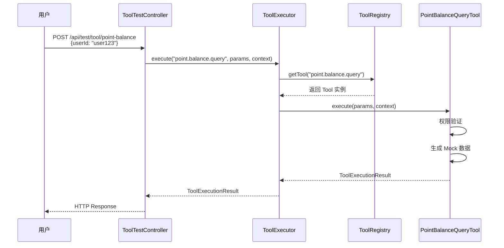

# 第二阶段：最小 AI Agent 闭环 - Tool Runtime 详解

> **文档目标**：帮助你深入理解 Tool Runtime 的设计原理、架构思想和实现细节  
> **适用场景**：学习企业级 AI 系统的工具调用层设计  
> **前置知识**：Java、Spring Boot、AI Agent 基本概念

---

##  目录

1. [为什么要做 Tool Runtime？](#1-为什么要做-tool-runtime)
2. [Tool Runtime 解决了什么问题？](#2-tool-runtime-解决了什么问题)
3. [核心组件架构图](#3-核心组件架构图)
4. [每个组件的详细解析](#4-每个组件的详细解析)
5. [数据流转过程](#5-数据流转过程)
6. [关键设计决策与权衡](#6-关键设计决策与权衡)
7. [代码阅读指南](#7-代码阅读指南)
8. [常见疑问解答](#8-常见疑问解答)
9. [下一步演进方向](#9-下一步演进方向)

---

## 1. 为什么要做 Tool Runtime？

### 1.1 背景：AI Agent 需要"手"和"脚"

想象一下，你有一个非常聪明的 AI（大脑），但它没有手和脚，无法与现实世界交互：

```
用户问："帮我查询积分余额"

AI 大脑思考：
✅ 我知道"积分余额"是什么
✅ 我知道需要调用某个 API
❌ 但我无法直接调用 API
❌ 我无法访问数据库
❌ 我无法发送 HTTP 请求
```

**问题**：AI 只能聊天，不能做事。

**解决方案**：给 AI 装上"工具"（Tools），让它能调用外部系统。

### 1.2 行业现状：三种主流方案

| 方案 | 代表框架 | 优点 | 缺点 | 适用场景 |
|------|---------|------|------|----------|
| **Function Calling** | OpenAI, Spring AI | 简单、集成度高 | 功能有限、不够灵活 | 简单场景 |
| **LangChain Tools** | LangChain, LangChain4j | 功能强大、生态丰富 | 学习曲线陡峭、黑盒 | 快速原型 |
| **自定义 Tool Runtime** | 企业自研 | 完全可控、符合规范 | 需要自己实现 | **企业级应用** ✅ |

**我们的选择**：自定义 Tool Runtime

**原因**：
1. **银行场景要求高**：权限控制、审计日志、安全合规
2. **长期维护**：需要清晰的架构，便于后续扩展
3. **培养工程思维**：理解底层原理，而不是只会调库

---

## 2. Tool Runtime 解决了什么问题？

### 2.1 核心问题清单

#### ❌ 问题 1：AI 如何知道有哪些工具可用？

**错误做法**：硬编码在 Prompt 里
```java
// 不推荐：每次新增工具都要改 Prompt
String prompt = "你可以使用以下工具：\n" +
                "1. point.balance.query - 查询积分\n" +
                "2. leave.query - 查询假期\n" +
                "...";
```

**正确做法**：通过 Registry 动态管理
```java
// 推荐：工具自动注册，Prompt 动态生成
toolRegistry.register(pointBalanceTool);
toolRegistry.register(leaveQueryTool);
// Prompt Manager 自动从 Registry 获取工具列表
```

#### ❌ 问题 2：如何保证工具调用的安全性？

**风险场景**：
- 用户 A 想查询用户 B 的积分（越权）
- 用户输入恶意参数（SQL 注入、XSS）
- 工具执行超时，阻塞整个系统

**解决方案**：统一的 Executor 层
```java
// ToolExecutor 集中处理横切关注点
1. 权限检查（PermissionChecker）
2. 参数校验（ParameterValidator）
3. 超时控制（TimeoutHandler）
4. 重试机制（RetryHandler）
5. 审计日志（AuditLogger）
```

#### ❌ 问题 3：如何标准化不同工具的返回格式？

**问题**：不同工具返回格式不一致，AI 难以理解

```json
// 工具 A 返回
{"code": 0, "data": {"points": 1000}}

// 工具 B 返回
{"success": true, "result": 1000}

// 工具 C 返回
{"status": "ok", "balance": 1000}
```

**解决方案**：统一的 `ToolExecutionResult`

```json
{
  "success": true,
  "data": "{...}",  // JSON 字符串，便于 AI 解析
  "error": null,
  "errorCode": null,
  "executionTimeMs": 14,
  "retryCount": 0
}
```

---

## 3. 核心组件架构图

```
┌─────────────────────────────────────────────────────────────┐
│                        AI Layer                             │
│  ┌───────────────────────────────────────────────────────┐  │
│  │  Agent Orchestrator (ReAct Loop)                      │  │
│  │  "我需要调用 point.balance.query 工具"                  │  │
│  └──────────────────────┬────────────────────────────────┘  │
└─────────────────────────┼───────────────────────────────────┘
                          │ execute(toolName, parameters, context)
                          ▼
┌─────────────────────────────────────────────────────────────┐
│                   Tool Executor (核心)                       │
│  ┌───────────────────────────────────────────────────────┐  │
│  │  Step 1: 查找工具                                       │  │
│  │    tool = toolRegistry.getTool(toolName)               │  │
│  └──────────────────────┬────────────────────────────────┘  │
│  ┌───────────────────────────────────────────────────────┐  │
│  │  Step 2: 权限检查（如果需要）                            │  │
│  │    if (requiresAuth) permissionChecker.check(...)      │  │
│  └──────────────────────┬────────────────────────────────┘  │
│  ┌───────────────────────────────────────────────────────┐  │
│  │  Step 3: 参数校验（如果有定义）                          │  │
│  │    parameterValidator.validate(parameters, schema)     │  │
│  └──────────────────────┬────────────────────────────────┘  │
│  ───────────────────────────────────────────────────────┐  │
│  │  Step 4: 执行工具（带重试）                              │  │
│  │    result = tool.execute(parameters, context)          │  │
│  └──────────────────────┬────────────────────────────────┘  │
│  ┌───────────────────────────────────────────────────────┐  │
│  │  Step 5: 返回标准化结果                                  │  │
│  │    return ToolExecutionResult.success/failure(...)     │  │
│  └───────────────────────────────────────────────────────┘  │
└─────────────────────────┬───────────────────────────────────┘
                          │
                          ▼
┌─────────────────────────────────────────────────────────────┐
│                    Tool Registry                            │
│  ┌───────────────────────────────────────────────────────┐  │
│  │  tools: Map<String, Tool>                             │  │
│  │  - "point.balance.query" → PointBalanceQueryTool      │  │
│  │  - "leave.query"         → LeaveQueryTool             │  │
│  │  - ...                                                │  │
│  └───────────────────────────────────────────────────────┘  │
└─────────────────────────┬───────────────────────────────────┘
                          │
                          ▼
┌─────────────────────────────────────────────────────────────┐
│                 具体工具实现（可扩展）                         │
│  ┌───────────────────────────────────────────────────────┐  │
│  │  PointBalanceQueryTool                                │  │
│  │  ├── getDefinition() → ToolDefinition                 │  │
│  │  └── execute(params, context) → ToolExecutionResult   │  │
│  └───────────────────────────────────────────────────────┘  │
│  ┌───────────────────────────────────────────────────────┐  │
│  │  LeaveQueryTool (未来扩展)                             │  │
│  └───────────────────────────────────────────────────────┘  │
│  ┌───────────────────────────────────────────────────────┐  │
│  │  ApprovalSubmitTool (未来扩展)                         │  │
│  └───────────────────────────────────────────────────────  │
└─────────────────────────────────────────────────────────────┘
```

---

## 4. 每个组件的详细解析

### 4.1 ToolDefinition - 工具的"身份证"

**文件位置**：[ToolDefinition.java](file://C:\atom\data\IdeaProjects\AI-copilot\bank-ai-assistant\src\main\java\com\bank\assistant\tool\runtime\ToolDefinition.java)

**作用**：描述工具的元数据，让 AI 和系统都能理解这个工具

**关键字段解析**：

```java
@Data
@Builder
public class ToolDefinition {
    
    // 1️⃣ 工具名称（唯一标识）
    // 命名规范：{domain}.{action}.{resource}
    // 例如：point.balance.query, leave.apply.submit
    private String name;
    
    // 2️⃣ 工具描述（AI 理解的关键！）
    // 这是最重要的字段，直接影响 AI 能否正确使用工具
    // 需要清晰描述：功能、适用场景、返回值含义
    private String description;
    
    // 3️⃣ 参数定义（JSON Schema 格式）
    // 用于运行时参数校验
    // 示例：{"type":"object","properties":{"userId":{"type":"string"}},"required":["userId"]}
    private String parameters;
    
    // 4️⃣ 是否需要权限检查
    // true: 执行前验证用户权限（如查询个人积分）
    // false: 无需权限（如查询公开信息）
    @Builder.Default
    private Boolean requiresAuth = true;
    
    // 5️⃣ 是否为安全操作（只读）
    // true: 只读操作，可以直接执行（如查询）
    // false: 写操作，需要二次确认（如提交审批）
    @Builder.Default
    private Boolean isSafe = true;
    
    // 6️ 超时时间（毫秒）
    // 防止工具长时间阻塞
    @Builder.Default
    private Integer timeoutMs = 3000;
    
    // 7️ 重试次数
    // 网络波动时的容错机制
    @Builder.Default
    private Integer retryCount = 2;
}
```

**为什么这样设计？**

| 字段 | 设计原因 | 如果不加会怎样？ |
|------|---------|-----------------|
| `name` | 唯一标识工具 | AI 无法准确指定要调用哪个工具 |
| `description` | AI 理解工具用途 | AI 可能选错工具或不会用 |
| `parameters` | 参数校验 | 恶意输入可能导致系统崩溃 |
| `requiresAuth` | 权限控制 | 用户可以查询别人的隐私数据 |
| `isSafe` | 区分读写操作 | 写操作没有二次确认，风险高 |
| `timeoutMs` | 防止阻塞 | 一个慢工具卡死整个系统 |
| `retryCount` | 容错机制 | 网络波动导致频繁失败 |

---

### 4.2 ToolExecutionResult - 标准化的返回格式

**文件位置**：[ToolExecutionResult.java](file://C:\atom\data\IdeaProjects\AI-copilot\bank-ai-assistant\src\main\java\com\bank\assistant\tool\runtime\ToolExecutionResult.java)

**作用**：统一所有工具的返回格式，便于 AI 解析和系统监控

**结构解析**：

```java
@Data
@Builder
public class ToolExecutionResult {
    
    // 1️⃣ 是否成功
    private Boolean success;
    
    // 2️⃣ 成功时的数据（JSON 字符串）
    // 为什么是字符串？因为 AI 更容易处理文本
    private String data;
    
    // 3️⃣ 失败时的错误信息
    private String error;
    
    // 4️⃣ 错误码（便于程序判断）
    private String errorCode;
    
    // 5️ 执行耗时（用于监控和优化）
    private Long executionTimeMs;
    
    // 6️⃣ 重试次数（用于分析稳定性）
    private Integer retryCount;
    
    // 便捷方法
    public static ToolExecutionResult success(String data, Long executionTimeMs) {...}
    public static ToolExecutionResult failure(String error, String errorCode) {...}
}
```

**实际返回示例**：

```json
{
  "success": true,
  "data": "{\"totalPoints\":5000,\"availablePoints\":4800,\"recentTransactions\":[...]}",
  "error": null,
  "errorCode": null,
  "executionTimeMs": 14,
  "retryCount": 0
}
```

**为什么 data 是 JSON 字符串而不是对象？**

1. **AI 友好**：LLM 更容易理解文本格式的 JSON
2. **灵活性**：不同工具返回的数据结构不同，用字符串避免类型问题
3. **序列化**：便于在网络传输和日志记录

---

### 4.3 Tool - 工具接口

**文件位置**：[Tool.java](file://C:\atom\data\IdeaProjects\AI-copilot\bank-ai-assistant\src\main\java\com\bank\assistant\tool\runtime\Tool.java)

**作用**：定义所有工具必须实现的契约

**接口设计**：

```java
public interface Tool {
    
    /**
     * 获取工具定义
     * 返回 ToolDefinition，告诉系统这个工具的元数据
     */
    ToolDefinition getDefinition();
    
    /**
     * 执行工具
     * @param parameters 参数 Map（key: 参数名, value: 参数值）
     * @param context    执行上下文（用户信息、会话ID等）
     * @return 执行结果
     */
    ToolExecutionResult execute(Map<String, Object> parameters, ExecutionContext context);
    
    /**
     * 执行上下文接口
     * 封装工具执行时需要的上下文信息
     */
    interface ExecutionContext {
        String getUserId();       // 当前用户 ID
        String getUserRole();     // 当前用户角色
        String getSessionId();    // 会话 ID
        String getRequestId();    // 请求 ID（链路追踪）
        Object getAttribute(String key);   // 获取额外属性
        void setAttribute(String key, Object value); // 设置额外属性
    }
}
```

**设计原则**：

1. **单一职责**：每个工具只做一件事
2. **无状态**：工具本身不保存状态，状态由外部管理
3. **可测试**：易于单元测试和 Mock
4. **可观测**：执行过程可监控、可追踪

**为什么参数是 `Map<String, Object>` 而不是强类型？**

- **灵活性**：不同工具的参数不同，用 Map 避免为每个工具定义单独的 DTO
- **动态性**：AI 生成的参数是动态的，无法提前定义类型
- **简化**：减少样板代码

---

### 4.4 ToolRegistry - 工具注册中心

**文件位置**：[ToolRegistry.java](file://C:\atom\data\IdeaProjects\AI-copilot\bank-ai-assistant\src\main\java\com\bank\assistant\tool\runtime\ToolRegistry.java)

**作用**：管理所有已注册的工具，提供查询能力

**核心方法**：

```java
@Component
public class ToolRegistry {
    
    // 线程安全的工具存储
    private final Map<String, Tool> tools = new ConcurrentHashMap<>();
    
    // 1️⃣ 注册工具
    public void register(Tool tool) {
        // 验证工具不为空
        // 验证工具名称不为空
        // 存入 Map
        tools.put(toolName, tool);
    }
    
    // 2️⃣ 根据名称获取工具
    public Tool getTool(String toolName) {
        return tools.get(toolName);
    }
    
    // 3️⃣ 检查工具是否存在
    public boolean hasTool(String toolName) {
        return tools.containsKey(toolName);
    }
    
    // 4️ 获取所有工具名称
    public Set<String> getAllToolNames() {
        return tools.keySet();
    }
    
    // 5️ 注销工具
    public boolean unregister(String toolName) {
        return tools.remove(toolName) != null;
    }
}
```

**为什么用 `ConcurrentHashMap`？**

- **线程安全**：多个请求可能同时访问 Registry
- **高性能**：读多写少场景下性能优于 `synchronized Map`
- **无锁**：读操作不需要加锁

**为什么需要 Registry？**

1. **解耦**：AI 层不需要知道具体有哪些工具
2. **动态扩展**：可以在运行时注册/注销工具
3. **统一管理**：集中管理工具元数据
4. **便于监控**：可以统计工具有多少个、哪些被调用最多

---

### 4.5 ToolExecutor - 工具执行器（核心！）

**文件位置**：[ToolExecutor.java](file://C:\atom\data\IdeaProjects\AI-copilot\bank-ai-assistant\src\main\java\com\bank\assistant\tool\runtime\ToolExecutor.java)

**作用**：统一工具调用入口，处理横切关注点

**执行流程**：

```java
@Component
@RequiredArgsConstructor
public class ToolExecutor {
    
    private final ToolRegistry toolRegistry;
    
    public ToolExecutionResult execute(String toolName, 
                                       Map<String, Object> parameters, 
                                       Tool.ExecutionContext context) {
        
        long startTime = System.currentTimeMillis();
        
        try {
            // Step 1: 查找工具
            Tool tool = toolRegistry.getTool(toolName);
            if (tool == null) {
                return ToolExecutionResult.failure("Tool not found", "TOOL_NOT_FOUND");
            }
            
            ToolDefinition definition = tool.getDefinition();
            
            // Step 2: 权限检查（如果需要）
            if (Boolean.TRUE.equals(definition.getRequiresAuth())) {
                // TODO: 后续实现
                // if (!permissionChecker.check(context.getUserId(), toolName)) {
                //     return ToolExecutionResult.failure("Permission denied", "PERMISSION_DENIED");
                // }
            }
            
            // Step 3: 参数校验（如果有定义）
            if (definition.getParameters() != null && !definition.getParameters().isEmpty()) {
                // TODO: 后续实现
                // ToolExecutionResult validationResult = parameterValidator.validate(...);
                // if (!validationResult.getSuccess()) {
                //     return validationResult;
                // }
            }
            
            // Step 4: 执行工具（带超时和重试）
            ToolExecutionResult result = executeWithRetry(tool, parameters, context, definition);
            
            long executionTime = System.currentTimeMillis() - startTime;
            result.setExecutionTimeMs(executionTime);
            
            return result;
            
        } catch (Exception e) {
            log.error("Tool execution failed: {}", toolName, e);
            return ToolExecutionResult.failure("Internal error: " + e.getMessage(), "INTERNAL_ERROR");
        }
    }
    
    // 带重试的执行逻辑
    private ToolExecutionResult executeWithRetry(...) {
        int maxRetries = definition.getRetryCount() != null ? definition.getRetryCount() : 2;
        
        for (int attempt = 0; attempt <= maxRetries; attempt++) {
            try {
                ToolExecutionResult result = tool.execute(parameters, context);
                
                // 如果成功，直接返回
                if (Boolean.TRUE.equals(result.getSuccess())) {
                    result.setRetryCount(attempt);
                    return result;
                }
                
                // 如果失败且还有重试机会，等待后重试
                if (attempt < maxRetries) {
                    Thread.sleep(500 * (attempt + 1)); // 递增等待
                }
                
            } catch (Exception e) {
                lastException = e;
            }
        }
        
        // 所有重试都失败了
        return ToolExecutionResult.failure("Failed after retries", "EXECUTION_FAILED");
    }
}
```

**为什么需要 Executor？**

| 关注点 | 如果没有 Executor | 有了 Executor |
|--------|------------------|---------------|
| **权限检查** | 每个工具自己实现，容易遗漏 | 统一处理，确保不漏 |
| **参数校验** | 重复代码多 | 集中管理，复用性强 |
| **超时控制** | 难以统一 | 一刀切，简单高效 |
| **重试机制** | 每个工具自己实现 | 统一策略，易于调整 |
| **审计日志** | 分散在各处 | 集中记录，便于分析 |
| **异常处理** | 格式不统一 | 标准化返回，AI 易理解 |

---

### 4.6 PointBalanceQueryTool - 第一个具体工具

**文件位置**：[PointBalanceQueryTool.java](file://C:\atom\data\IdeaProjects\AI-copilot\bank-ai-assistant\src\main\java\com\bank\assistant\tool\points\PointBalanceQueryTool.java)

**作用**：实现积分查询功能（Demo 级：Mock 数据）

**实现要点**：

```java
@Component
@RequiredArgsConstructor
public class PointBalanceQueryTool implements Tool {
    
    private final ObjectMapper objectMapper = new ObjectMapper();
    
    // 1️ 定义工具元数据
    private static final ToolDefinition DEFINITION = ToolDefinition.builder()
            .name("point.balance.query")
            .description("查询用户的积分余额。返回当前可用积分总数、最近变动记录等信息。适用于用户询问'我有多少积分'、'查看我的积分'等场景。")
            .parameters("{\"type\":\"object\",\"properties\":{\"userId\":{\"type\":\"string\",\"description\":\"用户ID\"}},\"required\":[\"userId\"]}")
            .requiresAuth(true)  // 需要权限检查
            .isSafe(true)        // 只读操作
            .timeoutMs(3000)
            .retryCount(2)
            .build();
    
    @Override
    public ToolDefinition getDefinition() {
        return DEFINITION;
    }
    
    @Override
    public ToolExecutionResult execute(Map<String, Object> parameters, ExecutionContext context) {
        
        try {
            // Step 1: 提取参数
            String userId = (String) parameters.get("userId");
            if (userId == null || userId.isEmpty()) {
                return ToolExecutionResult.failure("Missing required parameter: userId", "MISSING_PARAMETER");
            }
            
            // Step 2: 权限验证（只能查自己的积分）
            if (!userId.equals(context.getUserId())) {
                return ToolExecutionResult.failure("You can only query your own points", "PERMISSION_DENIED");
            }
            
            // Step 3: 查询积分（Demo 级：Mock 数据）
            Map<String, Object> mockData = queryMockPointBalance(userId);
            
            // Step 4: 转换为 JSON 字符串
            String resultJson = objectMapper.writeValueAsString(mockData);
            
            return ToolExecutionResult.success(resultJson, null);
            
        } catch (Exception e) {
            return ToolExecutionResult.failure("Internal error: " + e.getMessage(), "INTERNAL_ERROR");
        }
    }
    
    // Mock 数据生成
    private Map<String, Object> queryMockPointBalance(String userId) {
        Map<String, Object> result = new HashMap<>();
        result.put("userId", userId);
        result.put("totalPoints", userId.hashCode() % 10000 + 1000);
        result.put("availablePoints", ...);
        result.put("recentTransactions", [...]);
        return result;
    }
}
```

**为什么先做 Demo 级实现？**

1. **快速验证**：先跑通整个流程，再优化细节
2. **降低复杂度**：避免一开始就陷入数据库、API 调用的细节
3. **渐进式演进**：Demo → 基础 → 企业级，逐步完善

**后续演进路线**：

```
Demo 级（当前）          基础级（下一步）              企业级（未来）
─ Mock 数据            ├─ 调用真实 API              ├─ 完整缓存策略
├─ 简单权限检查          ├─ 数据库查询                ├─ 熔断降级
└─ 无监控               └─ 基础日志                  └─ 全链路追踪
                                                    └─ 性能优化
```

---

### 4.7 ToolConfiguration - 工具配置

**文件位置**：[ToolConfiguration.java](file://C:\atom\data\IdeaProjects\AI-copilot\bank-ai-assistant\src\main\java\com\bank\assistant\tool\config\ToolConfiguration.java)

**作用**：在应用启动时自动注册所有工具

**为什么用 `CommandLineRunner`？**

```java
@Component
@RequiredArgsConstructor
public class ToolConfiguration implements CommandLineRunner {
    
    private final ToolRegistry toolRegistry;
    private final PointBalanceQueryTool pointBalanceQueryTool;
    
    @Override
    public void run(String... args) {
        log.info("Registering tools...");
        
        // 注册工具
        toolRegistry.register(pointBalanceQueryTool);
        
        log.info("Tools registered successfully. Total: {}", toolRegistry.size());
    }
}
```

**CommandLineRunner 的执行时机**：

```
Spring Boot 启动流程：
1. 创建 ApplicationContext
2. 实例化所有 Bean
3. 依赖注入完成
4. ✅ 执行所有 CommandLineRunner.run() 方法
5. 应用启动完成
```

**好处**：
- 确保在所有 Bean 初始化完成后执行
- 集中管理工具注册逻辑
- 便于后续动态扩展（从数据库加载工具配置）

---

### 4.8 ToolTestController - 测试接口

**文件位置**：[ToolTestController.java](file://C:\atom\data\IdeaProjects\AI-copilot\bank-ai-assistant\src\main\java\com\bank\assistant\api\ToolTestController.java)

**作用**：提供 HTTP 接口，方便手动测试 Tool Runtime

**测试方法**：

```bash
# 使用 curl 测试
curl -X POST http://localhost:8080/api/test/tool/point-balance \
  -H "Content-Type: application/json" \
  -d '{"userId":"user123"}'

# 返回结果
{
  "success": true,
  "data": "{\"totalPoints\":5000,...}",
  "executionTimeMs": 14,
  "retryCount": 0
}
```

**为什么需要测试接口？**

1. **快速验证**：不用等 AI 层实现，就能测试 Tool Runtime
2. **调试方便**：可以直接看到工具的返回结果
3. **性能测试**：可以压测工具的执行性能

---

## 5. 数据流转过程

### 5.1 完整调用链路

```
用户请求
   ↓
─────────────────────────────────────────┐
│  1. HTTP Request                         │
│  POST /api/test/tool/point-balance       │
│  Body: {"userId": "user123"}             │
└──────────────┬──────────────────────────┘
               ↓
─────────────────────────────────────────┐
│  2. ToolTestController                   │
│  - 接收请求                               │
│  - 构建参数 Map                           │
│  - 创建 Mock ExecutionContext            │
│  - 调用 toolExecutor.execute()           │
──────────────┬──────────────────────────┘
               ↓
┌─────────────────────────────────────────┐
│  3. ToolExecutor                         │
│  - Step 1: 查找工具                       │
│    tool = registry.getTool("point.balance.query") │
│  - Step 2: 权限检查（TODO）               │
│  - Step 3: 参数校验（TODO）               │
│  - Step 4: 执行工具（带重试）             │
└──────────────┬──────────────────────────┘
               ↓
┌─────────────────────────────────────────┐
│  4. PointBalanceQueryTool                │
│  - 提取 userId 参数                       │
│  - 验证权限（只能查自己的）                │
│  - 生成 Mock 数据                         │
│  - 返回 ToolExecutionResult              │
└──────────────┬──────────────────────────┘
               ↓
┌─────────────────────────────────────────┐
│  5. ToolExecutor                         │
│  - 记录执行耗时                           │
│  - 返回最终结果                           │
──────────────┬──────────────────────────┘
               ↓
┌─────────────────────────────────────────┐
│  6. ToolTestController                   │
│  - 返回 HTTP Response                     │
──────────────┬──────────────────────────┘
               ↓
用户收到响应
```

### 5.2 时序图



---

## 6. 关键设计决策与权衡

### 6.1 为什么不用 Spring AI 的 Function Calling？

**Spring AI Function Calling 示例**：

```java
// Spring AI 方式
@Bean
public Function<PointQueryRequest, PointQueryResponse> pointBalanceQuery() {
    return request -> {
        // 业务逻辑
        return new PointQueryResponse(...);
    };
}
```

**对比分析**：

| 维度 | Spring AI Function Calling | 自定义 Tool Runtime |
|------|---------------------------|---------------------|
| **开发速度** | ⭐⭐⭐⭐⭐ 快 | ⭐⭐⭐ 中等 |
| **灵活性** | ⭐⭐ 低 | ⭐⭐⭐⭐⭐ 高 |
| **权限控制** | ⭐⭐ 弱 | ⭐⭐⭐⭐⭐ 强 |
| **参数校验** | ⭐⭐ 弱 | ⭐⭐⭐⭐⭐ 强 |
| **审计日志** | ⭐⭐ 弱 | ⭐⭐⭐⭐⭐ 强 |
| **学习成本** | ⭐⭐⭐⭐⭐ 低 | ⭐⭐⭐ 中等 |
| **企业适用性** | ⭐⭐ 低 | ⭐⭐⭐⭐⭐ 高 |

**结论**：银行场景对安全性、合规性要求高，自定义 Tool Runtime 更合适。

### 6.2 为什么参数用 `Map<String, Object>` 而不是强类型？

**方案对比**：

```java
// 方案 A：强类型（不推荐）
public interface Tool<T extends ToolRequest, R extends ToolResponse> {
    ToolExecutionResult<R> execute(T request, ExecutionContext context);
}

// 方案 B：Map（推荐）
public interface Tool {
    ToolExecutionResult execute(Map<String, Object> parameters, ExecutionContext context);
}
```

**权衡分析**：

| 维度 | 强类型 | Map |
|------|--------|-----|
| **类型安全** | ⭐⭐⭐⭐⭐ | ⭐⭐ |
| **IDE 支持** | ⭐⭐⭐⭐⭐ | ⭐⭐ |
| **灵活性** | ⭐⭐ | ⭐⭐⭐⭐⭐ |
| **代码量** | 多（每个工具一个 DTO） | 少（通用 Map） |
| **AI 友好度** | ⭐⭐ | ⭐⭐⭐⭐⭐ |

**结论**：AI 生成的参数是动态的，用 Map 更灵活，牺牲一点类型安全换取开发效率。

### 6.3 为什么 data 字段是 JSON 字符串？

**方案对比**：

```java
// 方案 A：泛型（不推荐）
public class ToolExecutionResult<T> {
    private Boolean success;
    private T data;  // 泛型
    private String error;
}

// 方案 B：JSON 字符串（推荐）
public class ToolExecutionResult {
    private Boolean success;
    private String data;  // JSON 字符串
    private String error;
}
```

**权衡分析**：

| 维度 | 泛型 | JSON 字符串 |
|------|------|-------------|
| **类型安全** | ⭐⭐⭐⭐⭐ | ⭐⭐ |
| **AI 解析难度** | ⭐⭐ 难 | ⭐⭐⭐⭐⭐ 易 |
| **序列化复杂度** | 高 | 低 |
| **日志可读性** | ⭐ | ⭐⭐⭐⭐⭐ |

**结论**：AI 更容易处理文本，用 JSON 字符串更符合 LLM 的工作方式。

---

## 7. 代码阅读指南

### 7.1 推荐阅读顺序

```
1️⃣ ToolDefinition.java
   ↓ 理解工具的元数据结构
   
2️⃣ ToolExecutionResult.java
   ↓ 理解标准化的返回格式
   
3️⃣ Tool.java
   ↓ 理解工具接口契约
   
4️⃣ ToolRegistry.java
   ↓ 理解工具注册和管理
   
5️⃣ ToolExecutor.java
   ↓ 理解核心执行逻辑（重点！）
   
6️⃣ PointBalanceQueryTool.java
   ↓ 看具体实现示例
   
7️⃣ ToolConfiguration.java
   ↓ 理解自动注册机制
   
8️ ToolTestController.java
   ↓ 理解如何测试
```

### 7.2 重点关注的问题

阅读每个文件时，思考以下问题：

#### ToolDefinition
-  为什么需要 `description` 字段？它对 AI 有什么作用？
- ❓ `requiresAuth` 和 `isSafe` 有什么区别？
- ❓ 如果去掉 `timeoutMs` 会有什么风险？

#### ToolExecutionResult
-  为什么 `data` 是字符串而不是对象？
- ❓ `executionTimeMs` 有什么用？
- ❓ 为什么需要 `errorCode`？

#### Tool
-  为什么参数是 `Map<String, Object>`？
- ❓ `ExecutionContext` 提供了哪些信息？
- ❓ 如果工具需要保存状态怎么办？

#### ToolRegistry
- ❓ 为什么用 `ConcurrentHashMap`？
-  如果两个工具同名会怎样？
- ❓ 如何实现动态注册（从数据库加载）？

#### ToolExecutor
- ❓ 为什么需要统一的 Executor？
- ❓ 重试机制是如何实现的？
- ❓ 如果工具执行超时怎么办？

#### PointBalanceQueryTool
- ❓ 为什么先做 Mock 实现？
- ❓ 权限检查在哪里做的？
- ❓ 如何演进为基础级和企业级？

---

## 8. 常见疑问解答

### Q1: 为什么不直接用 LangChain4j 的 Tools？

**A**: LangChain4j 的 Tools 功能强大，但：
1. **黑盒**：内部实现复杂，难以定制
2. **耦合**：与 LangChain4j 深度绑定
3. **学习成本**：需要理解 LangChain4j 的设计理念
4. **企业需求**：银行场景需要完全的自主可控

**建议**：先用自定义 Tool Runtime 理解原理，后续可以借鉴 LangChain4j 的优秀设计。

### Q2: Tool Registry 会不会成为性能瓶颈？

**A**: 不会，因为：
1. **读多写少**：工具注册只在启动时做一次，之后都是读操作
2. **ConcurrentHashMap**：读操作无锁，性能极高
3. **内存存储**：工具数量通常不超过 100 个，内存占用极小

**优化建议**：如果工具超过 1000 个，可以考虑分片或使用本地缓存。

### Q3: 如何处理工具的依赖关系？

**A**: 当前版本不支持工具依赖，后续可以这样设计：

```java
// 方案：声明工具依赖
ToolDefinition definition = ToolDefinition.builder()
    .name("approval.submit")
    .dependsOn(Arrays.asList("user.auth.verify", "form.validate"))
    .build();

// Executor 执行前检查依赖
if (definition.getDependsOn() != null) {
    for (String dep : definition.getDependsOn()) {
        if (!registry.hasTool(dep)) {
            throw new IllegalArgumentException("Missing dependency: " + dep);
        }
    }
}
```

### Q4: 如何监控工具的执行情况？

**A**: 可以在 ToolExecutor 中添加监控逻辑：

```java
// 方案：集成 Micrometer
@Component
public class ToolExecutor {
    
    private final MeterRegistry meterRegistry;
    
    public ToolExecutionResult execute(...) {
        Timer.Sample sample = Timer.start(meterRegistry);
        
        try {
            // 执行逻辑
        } finally {
            sample.stop(Timer.builder("tool.execution")
                .tag("tool.name", toolName)
                .register(meterRegistry));
        }
    }
}
```

### Q5: 如何实现工具的版本管理？

**A**: 可以在工具名称中加入版本号：

```java
// 方案：版本化工具名称
ToolDefinition definition = ToolDefinition.builder()
    .name("point.balance.query.v1")
    .build();

// 或者在 Definition 中增加 version 字段
ToolDefinition definition = ToolDefinition.builder()
    .name("point.balance.query")
    .version("1.0.0")
    .build();
```

---

## 9. 下一步演进方向

### 9.1 短期（本周）

1. **实现 AI Runtime 基础框架**
   - Prompt Manager：管理 System Prompt、用户消息
   - Context Builder：构建对话上下文
   - Agent Orchestrator：ReAct Loop + Tool Calling

2. **完善 Tool Runtime**
   - 实现 PermissionChecker（权限检查）
   - 实现 ParameterValidator（参数校验）
   - 添加超时控制（CompletableFuture）

### 9.2 中期（本月）

1. **实现第二个 Tool**
   - LeaveQueryTool（假期查询）
   - WorkTimeQueryTool（工时查询）

2. **升级 PointBalanceQueryTool**
   - 从 Mock 数据改为真实 API 调用
   - 添加 Redis 缓存
   - 添加熔断降级（Resilience4j）

3. **添加监控和日志**
   - 集成 Micrometer + Prometheus
   - 添加分布式追踪（Sleuth + Zipkin）

### 9.3 长期（本季度）

1. **实现 RAG 模块**
   - 文档入库（解析→切片→Embedding→pgvector）
   - 在线检索（Query Rewrite→权限过滤→Hybrid Retrieval→Rerank）

2. **实现 Workflow 引擎**
   - 状态机设计
   - Human-in-the-Loop 确认机制

3. **升级为 Multi-Agent**
   - Router Agent（路由）
   - Specialist Agents（专业代理）
   - Coordinator Agent（协调）

---

## 📝 总结

### 核心收获

1. **Tool Runtime 的本质**：给 AI 装上"手"和"脚"，让它能与现实世界交互
2. **架构设计原则**：统一入口（Executor）、集中管理（Registry）、标准化输出（ToolExecutionResult）
3. **企业级考量**：权限控制、参数校验、超时重试、审计日志
4. **渐进式演进**：Demo → 基础 → 企业级，逐步完善

### 关键文件清单

| 文件 | 作用 | 重要性 |
|------|------|--------|
| ToolDefinition.java | 工具元数据 | ⭐⭐⭐⭐⭐ |
| ToolExecutionResult.java | 标准化返回 | ⭐⭐⭐⭐⭐ |
| Tool.java | 工具接口 | ⭐⭐⭐⭐⭐ |
| ToolRegistry.java | 工具注册中心 | ⭐⭐⭐⭐ |
| ToolExecutor.java | 工具执行器 | ⭐⭐⭐⭐⭐ |
| PointBalanceQueryTool.java | 第一个工具实现 | ⭐⭐⭐ |
| ToolConfiguration.java | 自动注册配置 | ⭐⭐⭐ |
| ToolTestController.java | 测试接口 | ⭐⭐ |

### 下一步行动

1. ✅ **消化本文档**：理解每个组件的设计原理
2. ✅ **阅读源码**：按照推荐的顺序逐个文件阅读
3. ✅ **动手实验**：修改 PointBalanceQueryTool，尝试不同的实现
4. ✅ **提出问题**：有任何疑问随时问我
5.  **继续学习**：准备好后，我们进入 AI Runtime 的实现

---

**祝你学习顺利！** 🎉

如果有任何问题，欢迎随时提问。我会以技术导师的身份，循序渐进地带你掌握企业级 AI 系统开发的精髓。
